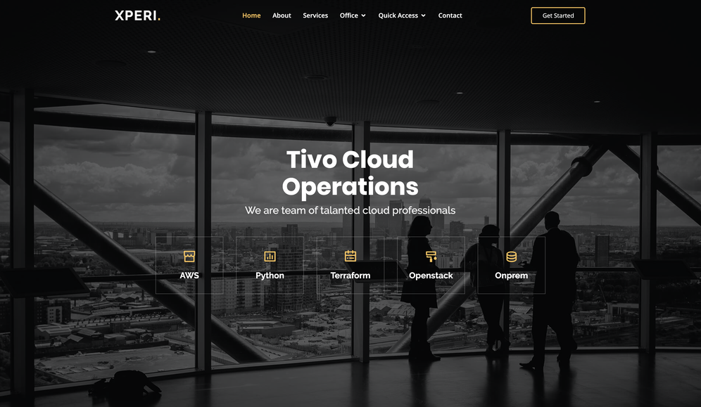

## Tivo Web Application


This project is to move the tools/programs which I am currently running in commandline or from a [docker container](https://github.com/nikhilvkn/PROJECT-Cloudendpoint-Check))
into a nice looking interface. I believe this will ease my teams work to execute those programs easily




```
Maintainer: Nikhil Narayanan [nikhilvkn@yahoo.com]
```
